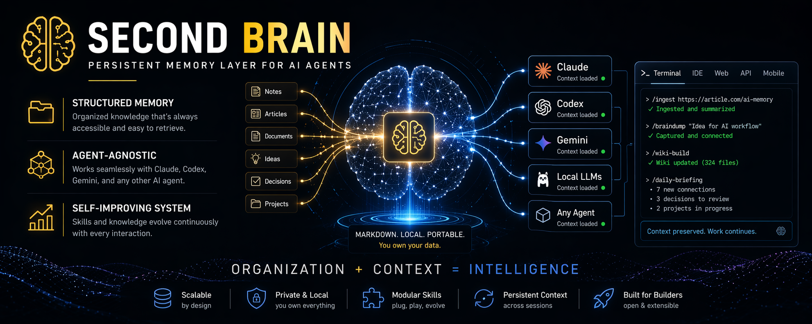
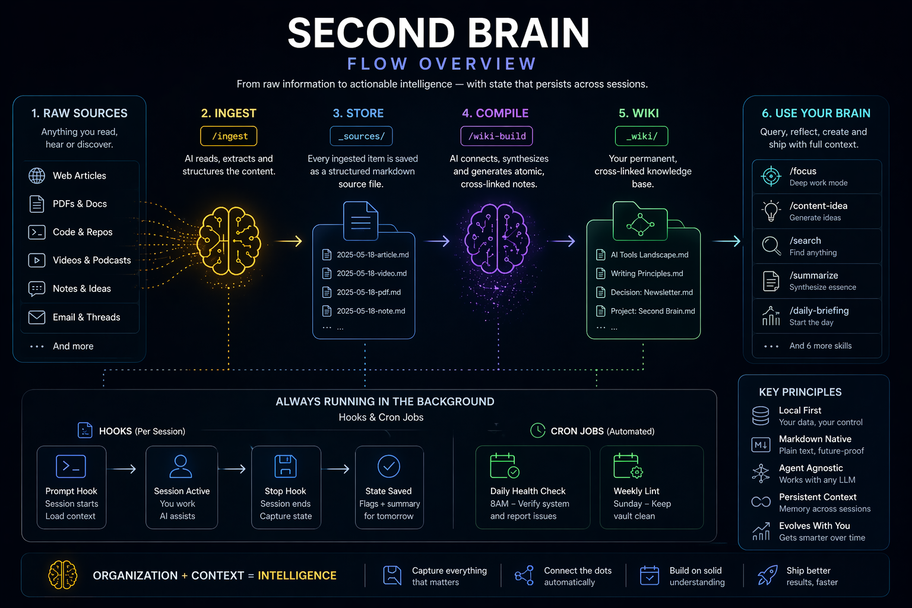
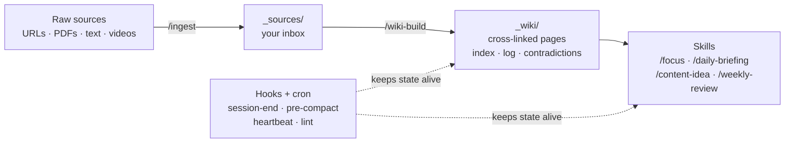
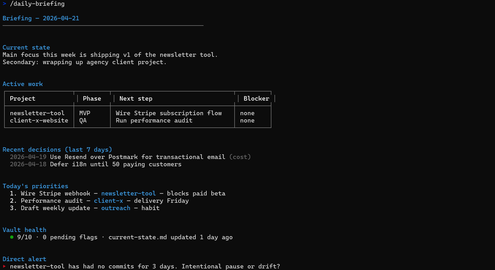
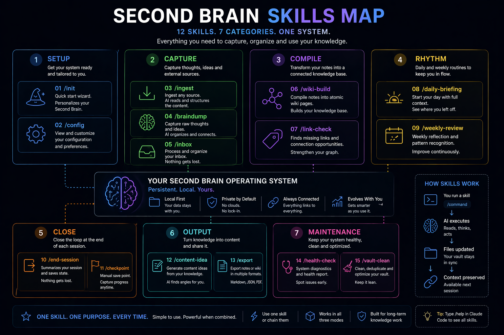

# second-brain-starter

> **A starter kit to build your own AI-powered second brain using Claude Code — that actually remembers what you taught it, session after session.**

[](LICENSE)
[](https://github.com/marciohideaki/second-brain-starter/actions/workflows/ci.yml)
[](https://docs.anthropic.com/claude-code)

**Who this is for:** software developers, content creators, marketers, students, researchers — anyone who reads, thinks, and writes for a living and wants the AI to remember what they've learned.

**What makes it different:** most AI tools forget everything when you close the tab. This one compiles what you feed it into a persistent wiki and carries context from one day to the next.

<p align="center">
  
</p>

👉 **New here? Jump to [First 15 minutes](#first-15-minutes) below.**

---

## Table of contents

- [What is a second brain?](#what-is-a-second-brain)
- [What this does, in plain English](#what-this-does-in-plain-english)
- [Prerequisites](#prerequisites)
- [Install](#install)
- [First 15 minutes](#first-15-minutes)
- [The 12 skills](#the-12-skills)
- [How this differs from other tools](#how-this-differs-from-other-tools)
- [Multi-agent support](#multi-agent-support)
- [Philosophy](#philosophy)
- [FAQ](#faq)
- [Troubleshooting](#troubleshooting)
- [Documentation](#documentation)
- [Contributing](#contributing)
- [License](#license)
- [🇧🇷 Português (BR)](#-português-br)

---

## What is a second brain?

A "second brain" is a place where you store everything you want to remember — notes, ideas, articles you read, decisions you made — so you don't have to hold it all in your head. The concept was popularized by Tiago Forte in his 2022 book [*Building a Second Brain*](https://www.buildingasecondbrain.com/).

Traditional second brains (Notion, Obsidian, Evernote) are **storage systems**. You put stuff in, you look stuff up. The AI-powered version adds something new: **the tool actually reads, organizes, and connects your material for you** — and remembers across sessions.

## What this does, in plain English

Imagine you:

- Read an article this morning and want to remember the key ideas.
- Made a decision yesterday and want to revisit it next month.
- Dropped a thought in the shower and want it captured before it's gone.
- Are starting a project tomorrow and want AI to remember the context next week.

With `second-brain-starter`, you type simple commands in Claude Code:

- `/ingest <article-url>` → Claude reads it, summarizes, saves it.
- `/braindump "random thought about X"` → Claude categorizes and connects it.
- `/wiki-build` → Claude compiles everything you've fed it into a searchable wiki.
- `/daily-briefing` → Claude shows you where you left off yesterday.

Every skill writes to plain markdown files on your disk. Nothing is locked in a cloud you can't export from.

## How it works

<p align="center">
  
</p>

<details>
<summary>📐 Diagram as text (fallback if image doesn't load)</summary>



</details>

---

## Prerequisites

You need three things before installing:

### 1. Claude Code (the CLI tool from Anthropic)

Claude Code is a command-line tool that lets you chat with Claude and have it edit your files.

Install it:

```bash
npm install -g @anthropic-ai/claude-code
```

Don't have Node.js / npm? Install from [nodejs.org](https://nodejs.org) first (pick the LTS version).

Verify it worked:

```bash
claude --version
```

You'll also need an Anthropic account with API access or a Claude Pro/Max subscription — follow the setup at [docs.anthropic.com/claude-code](https://docs.anthropic.com/claude-code).

### 2. `jq` (a tiny JSON processor used by the installer)

| OS | Command |
|----|---------|
| Ubuntu / Debian / WSL | `sudo apt install jq` |
| Fedora / RHEL | `sudo dnf install jq` |
| macOS | `brew install jq` |
| Windows (WSL) | same as Ubuntu |

### 3. `crontab` (comes pre-installed on Linux/macOS)

Check it's there:

```bash
crontab -l
```

If you see "no crontab for...", that's fine — it just means you don't have any scheduled jobs yet. `install.sh` will add two.

On **WSL**, cron isn't running by default. Start it with:

```bash
sudo service cron start
```

### Not using Linux or macOS?

- **Windows**: use [WSL2](https://learn.microsoft.com/en-us/windows/wsl/install). Native Windows is not supported.
- **ChromeOS**: works inside the Linux container.

---

## Install

Three commands total:

```bash
# 1. Download the repo to somewhere you can write to (no sudo needed)
git clone https://github.com/<YOUR-GITHUB>/second-brain-starter.git ~/second-brain

# 2. Go into the folder
cd ~/second-brain

# 3. Run the installer
./install.sh
```

The installer is idempotent — safe to run as many times as you want. It will never overwrite your personal data.

**What the installer does** (all reversible):

1. Creates shortcuts to 12 skills so Claude Code recognizes them in any folder.
2. Adds 4 small scripts that run automatically when Claude starts/ends a session.
3. Adds 2 scheduled tasks to your crontab (a daily health check and a weekly lint).
4. Appends a "Second Brain" section to `~/.claude/CLAUDE.md` so Claude reads your vault at session start.

See [Troubleshooting](#troubleshooting) below if anything goes wrong.

---

## First 15 minutes

After `install.sh` finishes, open any terminal and type:

```bash
claude
```

This opens a Claude Code session. Now try this flow:

### Minute 1-3 — Personalize your vault

Type in the Claude session:

```
/init
```

Claude will ask 5 quick questions (name, field, goal, tools). It fills in your `_knowledge/about-me.md` and `_knowledge/goals.md` automatically.

### Minute 3-7 — Capture a thought

Got something on your mind? Type:

```
/braindump I've been thinking about launching a newsletter. Not sure if weekly or biweekly. Topic would be my experiments with AI tools.
```

Claude organizes it, flags it as an idea, and connects it to your goals.

### Minute 7-12 — Ingest your first source

Paste an article URL, video transcript, or raw text:

```
/ingest https://example.com/an-article-i-just-read
```

Claude reads it, shows you a summary + key takeaways, and asks if you want to save it. You approve → it lands in `_sources/`.

Repeat with 2-3 more sources over the next days.

### Minute 12-15 — Compile your wiki

Once you have a few sources:

```
/wiki-build
```

Claude extracts concepts and entities from your sources, proposes wiki pages with cross-references, shows you the plan, and asks for approval. Your `_wiki/` folder fills up with cross-linked knowledge.

### Day 2 and beyond

Every morning:
```
/daily-briefing
```

Every time you end work:
```
/end-session
```

Every Monday:
```
/weekly-review
```

That's the rhythm. Everything else (hooks, cron jobs) happens in the background without you thinking about it.

<p align="center">
  
</p>

---

## The 12 skills

<p align="center">
  
</p>

| Skill | What it does | Example |
|-------|--------------|---------|
| `/init` | Personalizes your vault in 5 questions | `/init` |
| `/braindump [text]` | Captures a loose thought, categorizes, connects to prior notes | `/braindump I keep bouncing between ideas` |
| `/ingest [source]` | Reads a URL/file/text, summarizes, saves after your approval | `/ingest https://blog.com/article` |
| `/wiki-build` | Compiles all your sources into cross-linked wiki pages | `/wiki-build` |
| `/focus [project]` | Loads minimal context for one specific project | `/focus my-newsletter` |
| `/daily-briefing` | Morning summary: priorities, active projects, recent decisions | `/daily-briefing` |
| `/weekly-review` | Weekly reflection: what moved, what stalled, next week's top 3 | `/weekly-review` |
| `/end-session` | Closes session, saves learnings, updates project state | `/end-session` |
| `/session-handoff` | Writes HANDOFF.md so tomorrow's session resumes cleanly | `/session-handoff` |
| `/content-idea [topic]` | Generates 3-7 content ideas grounded in YOUR real material | `/content-idea LinkedIn post` |
| `/lint` | Checks vault health, flags broken links and stale notes | `/lint` |
| `/skill-improve [path]` | Runs an AI self-improvement loop on any skill | `/skill-improve _bootstrap/global/commands/content-idea.md` |

See [docs/en/skills-reference.md](docs/en/skills-reference.md) for every skill with sample outputs.

---

## How this differs from other tools

| | Obsidian (plain) | Notion AI | ChatGPT / NotebookLM | [NicholasSpisak/second-brain](https://github.com/NicholasSpisak/second-brain) | **second-brain-starter** |
|-|---|---|---|---|---|
| Auto-organizes your notes | ❌ | ⚠️ | ❌ | ✅ | ✅ |
| Remembers between sessions | ✅ (manual) | ⚠️ | ❌ | ✅ | ✅ |
| Warns you when you skipped a step | ❌ | ❌ | ❌ | ❌ | ✅ |
| Checks vault health automatically | ❌ | ❌ | ❌ | ❌ | ✅ |
| Improves its own skills over time | ❌ | ❌ | ❌ | ❌ | ✅ |
| Runs 100% locally on your files | ✅ | ❌ | ❌ | ✅ | ✅ |
| One-command install | — | — | — | `npx skills add` | `./install.sh` |

---

## Multi-agent support

Primary support is **Claude Code** (the richest set of hooks + native slash-commands). Adapters exist for Cursor, Gemini CLI, Codex CLI, and Antigravity at different maturity levels.

| Agent | Status | Install |
|-------|--------|---------|
| Claude Code | **stable** (default) | `./install.sh` |
| [Cursor](https://cursor.com) | **functional** | `./install.sh --agent=cursor` |
| [Gemini CLI](https://github.com/google-gemini/gemini-cli) | **beta** (SSOT + cron only) | `./install.sh --agent=gemini-cli` |
| [Codex CLI](https://github.com/openai/codex) | **stub** (community PR welcome) | `./install.sh --agent=codex` |
| Antigravity | **stub** (community PR welcome) | `./install.sh --agent=antigravity` |

**What you lose outside Claude Code:** the 4 event hooks (auto-detection of skipped `/end-session`, pre-compaction state snapshots, prompt logging, long-op notifications). Cron jobs and skill definitions still work in every adapter.

Full details + how to contribute a stronger adapter: [docs/en/multi-agent.md](docs/en/multi-agent.md).

---

## Philosophy

Three ideas drive the design:

1. **Compile knowledge once, at ingestion.** Don't make the AI re-read the same documents every time you ask a question. Pattern borrowed from [Karpathy's LLM Wiki](https://x.com/karpathy).

2. **Session continuity is infrastructure, not a skill.** Hooks and cron jobs keep state alive between sessions — you don't have to remember to run anything.

3. **Skills should measurably improve themselves.** The `/skill-improve` loop runs systematic A/B tests on any skill and keeps only the mutations that score better. Based on the [autoresearch loop pattern](https://aimaker.substack.com/p/how-i-built-skill-improves-all-skills-karpathy-autoresearch-loop).

<p align="center">
  
</p>

Read more: [docs/en/philosophy.md](docs/en/philosophy.md).

---

## FAQ

### "Do I need to be a developer to use this?"

No. You need to be comfortable copy-pasting commands into a terminal for the first 15 minutes (the install + first session). After that, you only type slash-commands in a Claude chat, which is no different from using ChatGPT.

### "Do I need to pay for Claude?"

Yes. Claude Code needs an Anthropic account — either pay-as-you-go API credits, or a Claude Pro/Max subscription. See [claude.com/pricing](https://claude.com/pricing).

### "Does this work on Windows?"

Only through [WSL2](https://learn.microsoft.com/en-us/windows/wsl/install) (Windows Subsystem for Linux). Native Windows is not supported. WSL is free and takes about 10 minutes to install.

### "Where does my data live?"

On your disk, in the folder where you cloned this repo. Every file is plain markdown. You can open the folder in Obsidian, Logseq, VS Code, or any text editor. Nothing is in the cloud.

### "Is my content sent to Anthropic?"

When you run a skill, Claude Code sends the relevant files to Anthropic's API to process — same as any other AI chat. When no skill is running, nothing is sent.

### "Can I use this without any of the cron jobs or hooks?"

Yes. They are all optional. See [docs/en/hooks-and-crons.md](docs/en/hooks-and-crons.md) for how to disable pieces.

### "Can I use my own GitHub repo to version this?"

Yes. Fork or clone, and push to your own remote. Your personal notes in `_sources/`, `_wiki/`, `_learnings/` get committed with the rest.

### "What's the difference between this and just using Claude directly?"

Claude forgets everything between sessions. This starter teaches Claude to read your vault at every session start, so context persists. It also gives you 12 pre-built skills that save you from reinventing prompts.

### "Will this work with other AI tools like Cursor, Gemini CLI, etc.?"

Yes, with different maturity levels. Claude Code is the primary target (all 4 hooks supported). Cursor has a **functional adapter** (rules + cron, no hooks). Gemini CLI, Codex CLI, and Antigravity have **stub adapters** (SSOT + cron; commands and hooks welcome PRs). Full matrix: [docs/en/multi-agent.md](docs/en/multi-agent.md).

---

## Troubleshooting

### "Permission denied" when running `install.sh`

```bash
chmod +x install.sh
./install.sh
```

### "jq: command not found"

Install it — see [Prerequisites](#prerequisites).

### "crontab: command not found" or cron not running

- **Linux/macOS:** `crontab` is pre-installed. Run `crontab -l` once to initialize.
- **WSL:** `sudo service cron start` to start the cron daemon, then re-run `./install.sh`.

### "I ran install.sh but skills don't appear in Claude Code"

Restart your Claude Code session. Skills are loaded from `~/.claude/commands/` at session start.

### "Hooks are not firing"

Check `~/.claude/settings.json` contains the hook entries and that hook scripts are executable:

```bash
chmod +x _bootstrap/global/hooks/*.sh
```

### "I want to uninstall everything"

```bash
# remove skill shortcuts
rm ~/.claude/commands/{braindump,ingest,focus,daily-briefing,weekly-review,end-session,session-handoff,content-idea,lint,init,wiki-build,skill-improve}.md

# remove cron jobs
crontab -e  # delete the heartbeat and lint lines

# (optional) remove the "## Second Brain" block from ~/.claude/CLAUDE.md
# (optional) revert ~/.claude/settings.json from its .bak file
```

More in [docs/en/troubleshooting.md](docs/en/troubleshooting.md).

---

## Documentation

- [Getting started](docs/en/getting-started.md) — detailed tour, glossary, first-session walkthrough.
- [Skills reference](docs/en/skills-reference.md) — every skill with sample outputs.
- [Hooks and crons](docs/en/hooks-and-crons.md) — what automation runs, how to disable it.
- [Multi-agent support](docs/en/multi-agent.md) — Cursor / Gemini CLI / Codex / Antigravity adapters.
- [Philosophy](docs/en/philosophy.md) — why the design choices.
- [FAQ](docs/en/faq.md) — common questions.
- [Troubleshooting](docs/en/troubleshooting.md) — when things break.

---

## Contributing

PRs, issues, and feedback welcome. See [CONTRIBUTING.md](CONTRIBUTING.md).

Every shell script passes `shellcheck` via CI. Please keep it that way.

## License

[MIT](LICENSE) — free to use, modify, fork, ship. Attribution appreciated but not required.

---

## 🇧🇷 Português (BR)

### O que é

Kit inicial para construir um "segundo cérebro" — um sistema de notas que a IA organiza e lembra por você — usando Claude Code.

Diferente do Notion ou Obsidian (que só armazenam), este starter faz a IA **ler, organizar e conectar** o que você guarda. Diferente do ChatGPT (que esquece tudo a cada sessão), este **lembra de um dia para o outro** porque escreve tudo em arquivos markdown no seu disco.

**Para quem:** desenvolvedores, criadores de conteúdo, marketing, publicitários, influencers, estudantes, pesquisadores — qualquer pessoa que lê, pensa e escreve todos os dias.

### O que você consegue fazer

- `/ingest <url-de-artigo>` → Claude lê, resume, salva.
- `/braindump "pensamento solto"` → Claude categoriza e conecta.
- `/wiki-build` → Claude compila tudo num wiki cruzado.
- `/daily-briefing` → Claude mostra onde você parou ontem.
- `/content-idea LinkedIn` → Claude gera ideias baseadas no SEU material real.

Tudo em markdown no seu disco. Você pode abrir com Obsidian, VS Code, ou qualquer editor.

<p align="center">
  
</p>

### Pré-requisitos

1. **Claude Code** (CLI da Anthropic): `npm install -g @anthropic-ai/claude-code` (precisa Node.js)
2. **jq** (processador de JSON): `sudo apt install jq` (Ubuntu/WSL) / `brew install jq` (macOS)
3. **crontab** (já vem no Linux/macOS; no WSL: `sudo service cron start`)
4. Conta Anthropic com créditos de API ou assinatura Claude Pro/Max — veja [claude.com/pricing](https://claude.com/pricing).

**Windows**: só funciona via [WSL2](https://learn.microsoft.com/pt-br/windows/wsl/install). Windows nativo não tem suporte.

### Instalação

Três comandos:

```bash
git clone https://github.com/<SEU-USUARIO>/second-brain-starter.git ~/second-brain
cd ~/second-brain
./install.sh
```

Depois, em qualquer sessão do Claude Code:

```
/init
```

### Primeiros 15 minutos

1. `/init` — wizard de 5 perguntas, personaliza o vault.
2. `/braindump "ideia qualquer"` — captura e organiza um pensamento.
3. `/ingest https://algum-artigo.com` — ingere uma fonte externa com sua aprovação.
4. Repita `/ingest` com mais 2-3 fontes ao longo dos dias.
5. `/wiki-build` — compila todas as fontes num wiki cruzado.

Depois: `/daily-briefing` no começo do dia, `/end-session` ao terminar, `/weekly-review` nas segundas.

### Skills (12)

`/init`, `/braindump`, `/ingest`, `/wiki-build`, `/focus`, `/daily-briefing`, `/weekly-review`, `/end-session`, `/session-handoff`, `/content-idea`, `/lint`, `/skill-improve`.

Referência completa: [docs/pt-br/skills-reference.md](docs/pt-br/skills-reference.md).

### Filosofia em 3 frases

1. Compila o conhecimento **uma vez**, na ingestão — depois responde do wiki (padrão Karpathy).
2. Continuidade de sessão é **infraestrutura**, não skill — hooks e cron cuidam disso.
3. Skills devem **se melhorar de forma mensurável** — `/skill-improve` roda o autoresearch loop.

### Suporte multi-agente

Suporte primário é **Claude Code** (4 hooks + slash-commands nativos). Existem adapters para Cursor, Gemini CLI, Codex CLI e Antigravity em níveis diferentes de maturidade.

| Agente | Status | Instalação |
|--------|--------|------------|
| Claude Code | **estável** (default) | `./install.sh` |
| [Cursor](https://cursor.com) | **funcional** | `./install.sh --agent=cursor` |
| [Gemini CLI](https://github.com/google-gemini/gemini-cli) | **beta** (SSOT + cron) | `./install.sh --agent=gemini-cli` |
| [Codex CLI](https://github.com/openai/codex) | **stub** (PR welcome) | `./install.sh --agent=codex` |
| Antigravity | **stub** (PR welcome) | `./install.sh --agent=antigravity` |

Fora do Claude Code você perde os 4 hooks de evento. Crons e skills continuam funcionando.

Detalhes: [docs/pt-br/multi-agent.md](docs/pt-br/multi-agent.md).

### FAQ (resumida)

**Preciso ser programador?** Não, só precisa copiar-colar 3 comandos no terminal na instalação. Depois é só chat.

**Preciso pagar pelo Claude?** Sim, conta Anthropic com créditos ou assinatura Claude Pro/Max.

**Funciona no Windows?** Só via WSL2. Windows nativo não.

**Meus dados vão para algum lugar?** Ficam no seu disco, em markdown. Quando você roda uma skill, o Claude Code envia os arquivos relevantes para a API da Anthropic processar (igual qualquer chat com Claude).

**Posso desligar os hooks/crons?** Sim, todos são opcionais. Ver [docs/pt-br/hooks-and-crons.md](docs/pt-br/hooks-and-crons.md).

FAQ completa: [docs/pt-br/faq.md](docs/pt-br/faq.md).

### Documentação

- [Começando](docs/pt-br/getting-started.md)
- [Referência de skills](docs/pt-br/skills-reference.md)
- [Hooks e crons](docs/pt-br/hooks-and-crons.md)
- [Suporte multi-agente](docs/pt-br/multi-agent.md)
- [Filosofia](docs/pt-br/philosophy.md)
- [FAQ](docs/pt-br/faq.md)
- [Troubleshooting](docs/pt-br/troubleshooting.md)

### Licença

[MIT](LICENSE) — livre para usar, modificar, forkar, publicar. Atribuição bem-vinda mas não obrigatória.
