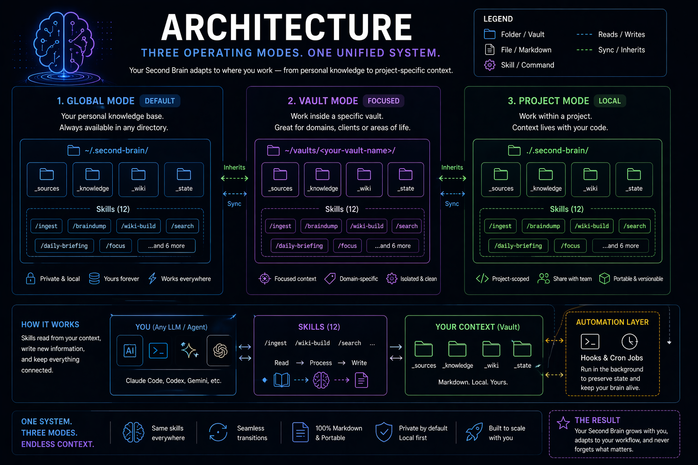
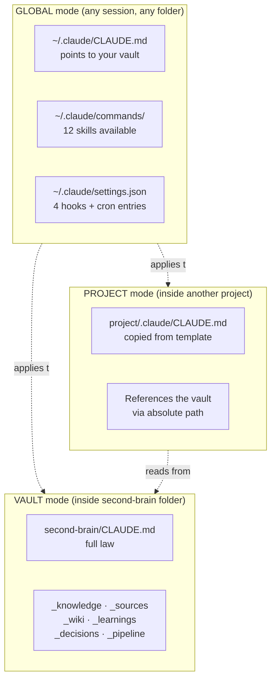

# Getting Started

A 10-minute tour from zero to a working second brain — written for someone who has never used Claude Code before.

<p align="center">
  
</p>

<details>
<summary>📐 Three operating modes (text)</summary>



</details>

## Before you start: key terms

A quick glossary so nothing trips you up.

| Term | Plain-English meaning |
|------|------------------------|
| **Claude Code** | A command-line tool from Anthropic. You type `claude` in your terminal and start chatting with Claude. It can read and edit files on your disk. |
| **Vault** | The folder where your second brain lives. You clone this repo into a folder, and that folder *is* your vault. |
| **Skill** | A pre-written instruction that turns into a slash-command in Claude Code. `/braindump`, `/ingest`, etc. Each is just a markdown file in `_bootstrap/global/commands/`. |
| **Hook** | A small script that runs automatically on an event (you submit a prompt, Claude ends a session, etc.). Four of them come pre-configured. |
| **Cron job** | A scheduled task in your operating system. The starter adds two: a daily health check (07:00) and a weekly lint (Monday 09:00). |
| **Markdown** | A lightweight text format with asterisks for bold, dashes for bullets. Every file in the vault is markdown. |
| **Frontmatter** | A small block at the top of a markdown file with metadata: `tags`, `status`, `created`. Looks like YAML between `---` lines. |
| **WikiLink** | A cross-reference to another note, written as `[[note-name]]`. Works like a Wikipedia link. |
| **Slash-command** | A command you type in Claude Code starting with `/`, like `/init`. |

---

## Prerequisites

### 1. Install Claude Code

Claude Code is a command-line tool from Anthropic. It lets you chat with Claude and have it edit your files.

```bash
npm install -g @anthropic-ai/claude-code
```

Don't have `npm` / Node.js? Install it first from [nodejs.org](https://nodejs.org) (pick LTS).

Verify:
```bash
claude --version
```

You'll also need an Anthropic account — either API credits (pay-as-you-go) or a Claude Pro/Max subscription. See [claude.com/pricing](https://claude.com/pricing).

### 2. Install `jq` (a tiny JSON tool the installer uses)

| OS | Command |
|----|---------|
| Ubuntu / Debian / WSL | `sudo apt install jq` |
| Fedora / RHEL | `sudo dnf install jq` |
| macOS | `brew install jq` |
| Windows (WSL) | same as Ubuntu |

### 3. Check `crontab` is available

```bash
crontab -l
```

If you see "no crontab for..." that's normal — the installer will add two entries.

On WSL, start the cron daemon:
```bash
sudo service cron start
```

### If you're on native Windows

It won't work. Install [WSL2](https://learn.microsoft.com/en-us/windows/wsl/install) first (takes ~10 minutes, it's free). Then run everything from the Ubuntu terminal WSL gives you.

---

## Install

```bash
# 1. Pick a folder where you want your vault (use your home directory — no sudo needed)
git clone https://github.com/marciohideaki/second-brain-starter.git ~/second-brain

# 2. Go into it
cd ~/second-brain

# 3. Run the installer
./install.sh
```

The installer is idempotent: safe to run multiple times. It never touches your personal data.

**What the installer does**, step by step:

1. Creates 12 shortcuts in `~/.claude/commands/` (one per skill). Claude Code picks them up at session start.
2. Adds 4 hook scripts to `~/.claude/settings.json`. They run on Claude Code events.
3. Appends a "Second Brain" section to `~/.claude/CLAUDE.md` so Claude reads your vault at session start.
4. Adds 2 cron jobs (daily heartbeat + weekly lint).
5. Seeds `_memory/current-state.md` and `_memory/activity-log.md`.

Output looks like:

```
=== second-brain-starter — bootstrap ===
Vault : /home/you/second-brain
Claude: /home/you/.claude

[1/5] Skills symlinks...
  ✓ /braindump
  ✓ /content-idea
  ... (12 total)

[2/5] Hooks in /home/you/.claude/settings.json...
  ✓ Hooks configured

[3/5] Global bridge in /home/you/.claude/CLAUDE.md...
  ✓ Block injected

[4/5] Cron jobs...
  ✓ daily-heartbeat (every day 07:00)
  ✓ weekly-vault-lint (Monday 09:00)

[5/5] Memory...
  ✓ activity-log.md created
  ✓ current-state.md seeded

=== Install complete ===
```

If anything went wrong, see [troubleshooting.md](troubleshooting.md).

---

## First session

Open any terminal, type `claude`. You'll be inside Claude Code. Everything below is typed into that chat.

### Step 1 — Run the setup wizard

```
/init
```

Claude asks 5 quick questions:
- What's your name?
- What's your main field?
- What's your current role?
- What's the one big thing you want to accomplish in the next 6-12 months?
- What are the main tools you use daily?

Claude fills your `_knowledge/about-me.md` and `_knowledge/goals.md` with the answers, seeds `_memory/current-state.md`, and shows you the first example flow for your profile.

Takes about 3 minutes.

### Step 2 — Capture your first thought

Got something on your mind? Type:

```
/braindump I've been bouncing between three project ideas for months. I need to pick one.
```

Claude:
1. Creates a session note in `_sessions/2026-04-21-braindump.md` with the raw text.
2. Categorizes each item (idea / decision / urgent / etc.).
3. Connects to `_knowledge/goals.md` via WikiLinks.
4. Writes back to your terminal:
   ```
   Summary: You're stuck between three project ideas.

   Actionable items (prioritized):
   - High: pick ONE project this week using a simple scoring rubric (see _decisions/)
   - Medium: write a one-pager for the winner

   Notes created:
   - _sessions/2026-04-21-braindump.md

   Connections: [[goals]], [[about-me]]

   Challenge: Your goals.md says "launch a product in 6 months" but bouncing between ideas for months contradicts that timeline. Pick today, not next week.
   ```

Takes 30 seconds.

### Step 3 — Ingest an article

```
/ingest https://example.com/article-you-just-read
```

Claude fetches the article, summarizes it, shows key claims and actionable takeaways, then asks: "Save to `_sources/`? (y/n)".

You approve → it lands in `_sources/2026-04-21-article-slug.md`. Claude offers to extract a learning (a condensed insight) into `_learnings/`.

Takes 1-2 minutes per source.

### Step 4 — Build your wiki

After you have 3 or more sources, type:

```
/wiki-build
```

Claude:
1. Reads every source.
2. Extracts entities, concepts, claims.
3. Proposes wiki pages with cross-references.
4. Shows you the plan:
   ```
   Proposed wiki pages (new):
   - _wiki/prompt-engineering.md — from 3 sources
   - _wiki/retrieval-augmented-generation.md — from 2 sources

   Cross-references planned:
   - [[prompt-engineering]] ↔ [[retrieval-augmented-generation]]

   Contradictions flagged:
   - Source A contradicts learning X on max context window

   Proceed? (y/n)
   ```
5. On your approval, writes the pages, updates `_wiki/index.md`, logs to `_wiki/log.md`, flags contradictions in `_wiki/contradictions.md`.

### Step 5 — End the session

```
/end-session
```

Claude writes to:
- `_memory/current-state.md` (what happened today, next steps)
- `_memory/activity-log.md` (timestamp + summary)
- `_knowledge/projects/<project>/work-log.md` (if a project was touched)
- Creates `_decisions/` or `_learnings/` notes for cross-cutting things

And clears pending-session flags.

Takes 1 minute.

### Step 6 — Come back tomorrow

Open a terminal, type:

```bash
claude
```

Then:

```
/daily-briefing
```

You get:
- Current state summary (from yesterday's `/end-session`).
- Active projects table with next steps.
- Recent decisions (last 7 days).
- Today's priorities (3-5 items ranked).
- Vault health (from the 07:00 cron).

You never "lost" context between sessions.

---

## The weekly rhythm

| When | What to run |
|------|-------------|
| Start of day | `/daily-briefing` |
| Whenever a thought arises | `/braindump "..."` |
| Just read something valuable | `/ingest <url-or-file>` |
| After a few ingests | `/wiki-build` |
| Starting project work | `/focus <project-name>` |
| End of day | `/end-session` |
| Stopping mid-task | `/session-handoff` |
| Every Monday | `/weekly-review` |
| Need ideas to write/post | `/content-idea <topic>` |
| Vault feels messy | `/lint` |
| Feel like a skill isn't great | `/skill-improve <path-to-skill.md>` |

You won't need all of them every day. `/braindump` + `/ingest` + `/daily-briefing` + `/end-session` is enough for 90% of people.

---

## What's next

- [Skills reference](skills-reference.md) — every skill with a sample output.
- [Hooks and crons](hooks-and-crons.md) — what runs in the background.
- [FAQ](faq.md) — common questions.
- [Troubleshooting](troubleshooting.md) — when things break.
- [Philosophy](philosophy.md) — why it's designed this way.
