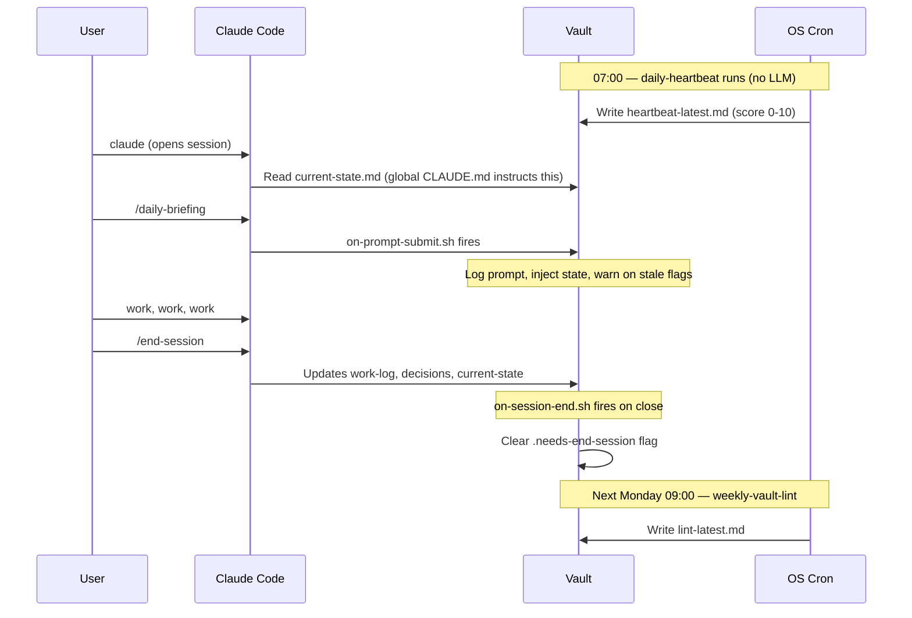

# Hooks and Cron Jobs

The starter wires four hooks and two cron jobs to keep the vault alive between explicit skill invocations. You can disable any piece without breaking the rest.

<p align="center">
  
</p>

<details>
<summary>📐 Session continuity timeline (text)</summary>



</details>

## Hooks (event-driven, fire inside Claude Code)

Defined in `_bootstrap/global/settings.json`, merged into `~/.claude/settings.json` by `install.sh`. Scripts live in `_bootstrap/global/hooks/`.

### `UserPromptSubmit` → `on-prompt-submit.sh`

Runs on every prompt you submit. It:

- Logs the prompt to `_memory/.prompt-log.txt` (gitignored, local only).
- If a project has `_knowledge/projects/{project-name}/state.md`, injects it once per day per project.
- Raises once-per-day alerts if:
  - The previous session ended without `/end-session`.
  - Context was compacted without `/end-session` first.
  - `_memory/current-state.md` hasn't been touched in more than 3 days.

If no alert applies, the hook exits silently. Timeout: 5 seconds.

### `SessionEnd` → `on-session-end.sh`

Fires when a Claude Code session terminates. It:

- Appends a `session-end` line to `_memory/activity-log.md`.
- Updates the `updated:` field in `_memory/current-state.md`.
- Creates `_memory/.needs-end-session` if `/end-session` wasn't explicitly run.

### `PreCompact` → `on-pre-compact.sh`

Fires just before Claude Code compacts the context. It:

- Snapshots your current Next Steps and Open Questions from `_memory/current-state.md` into `_memory/.pre-compact-notes.md`.
- Copies those notes into `_memory/activity-log.md`.
- Removes the `.pre-compact-notes.md` file.
- Creates `_memory/.compacted-without-end-session` if `/end-session` didn't run first.

### `Notification` → `on-notification.sh`

Fires when a long-running Claude Code operation finishes. Shows a Windows toast (WSL) or terminal bell (Linux/macOS).

---

## Cron jobs (time-driven, run outside Claude Code)

Registered in your OS crontab by `install.sh`. Scripts live in `_bootstrap/scripts/`. Output goes to `.logs/`.

### `daily-heartbeat.sh` — every day at 07:00

No LLM needed. Computes:

- Staleness of `_memory/current-state.md` (days since last update).
- Count of active projects (files with `status: active` in `_knowledge/projects/`).
- Count of ingested sources in `_sources/`.
- Count of compiled wiki pages in `_wiki/`.
- Pending session flags.

Writes `_memory/heartbeat-latest.md` with a 0-10 health score and a triage table.

### `weekly-vault-lint.sh` — Monday at 09:00

No LLM needed. Checks:

- Required frontmatter (`tags`, `status`, `created`) across `_learnings/`, `_decisions/`, `_pipeline/`, and `_knowledge/projects/`.
- Stale `status: active` notes (older than 30 days).
- Broken `[[WikiLinks]]` in `_wiki/` pages.

Writes `_memory/lint-latest.md`. Appends a critical alert to `_memory/heartbeat-latest.md` if defects exceed 5.

### `weekly-prompt-consolidation.sh` — Sunday at 23:00

No LLM needed at cron time. Checks accumulated prompts in `_memory/.prompt-log.txt` (written by `on-prompt-submit.sh`). When the count crosses a threshold (default 30):

- Generates structural stats: total prompts, slash command count, distinct project cwds, top 5 slash commands.
- Writes `_memory/.prompt-log-stats.txt`.
- Creates `_memory/.consolidation-ready` flag — `on-prompt-submit.sh` surfaces it on your next prompt with a suggestion to run an LLM analysis (skill of your choice).

The actual pattern analysis happens only when you invoke the skill — the cron just decides *when* there's enough signal to be worth analysing. Build your own analysis skill on top of `_memory/.prompt-log.txt` + `_memory/.prompt-log-stats.txt`.

To register the cron:

```
0 23 * * 0 bash {VAULT}/_bootstrap/scripts/weekly-prompt-consolidation.sh >> {VAULT}/.logs/weekly-prompt-consolidation.log 2>&1
```

---

## Session flags

Created and cleared automatically. You can also delete them manually if you know the vault is synced.

| Flag | Created when | Cleared by |
|------|--------------|-----------|
| `_memory/.needs-end-session` | A session ended without `/end-session` | The next `/end-session` |
| `_memory/.compacted-without-end-session` | Context was compacted without `/end-session` first | The next `/end-session` |

---

## Disabling pieces

### Disable a single hook

Edit `~/.claude/settings.json` and remove the hook entry for `UserPromptSubmit`, `SessionEnd`, `PreCompact`, or `Notification`. Re-running `install.sh` will re-add it, so if you want it off permanently, also remove the entry from `_bootstrap/global/settings.json`.

### Disable a cron job

```bash
crontab -e
# delete the line for daily-heartbeat.sh or weekly-vault-lint.sh
```

### Uninstall everything

```bash
# remove skill symlinks
rm ~/.claude/commands/{braindump,ingest,focus,daily-briefing,weekly-review,end-session,session-handoff,content-idea,lint,init,wiki-build,skill-improve}.md

# remove the vault block from ~/.claude/CLAUDE.md (delete everything under `## Second Brain`)

# remove hooks from ~/.claude/settings.json (revert to the .bak file if install.sh made one)

# remove cron jobs
crontab -e
```

---

## Troubleshooting

### "Hooks are not firing"

- Check `~/.claude/settings.json` has the hook entries.
- Check the hook scripts are executable: `chmod +x _bootstrap/global/hooks/*.sh`.
- Check `{VAULT}` was resolved in the settings (no literal `{VAULT}` should remain).

### "Cron jobs are not running"

- `crontab -l` to verify the entries exist.
- On WSL: `sudo service cron status` — start it if not running.
- Logs in `.logs/` should show the last run output.

### "Prompt log is filling up fast"

- `_memory/.prompt-log.txt` is gitignored but local. Rotate manually when it gets big:
  ```bash
  mv _memory/.prompt-log.txt _memory/.prompt-log-$(date +%Y%m%d).txt
  ```
