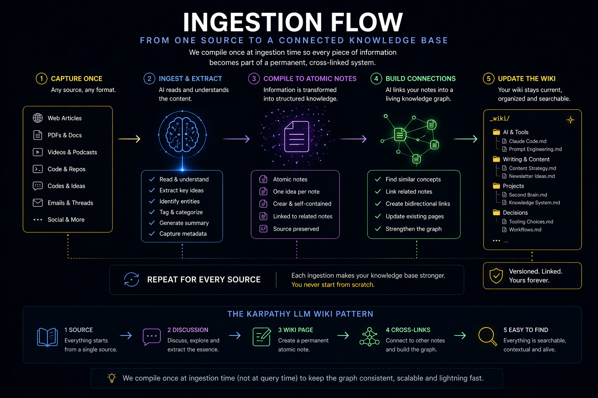

# Philosophy

Why does this exist, and why does it work?

## The three problems it solves

### 1. Knowledge that resets every session

Chat-based AI memory vanishes when you close the tab. Document-based AI tools (NotebookLM, ChatGPT uploads, Notion AI) re-read the raw material every query — they don't compound. You learn something today and lose it tomorrow.

The fix, borrowed from Andrej Karpathy's [LLM Wiki pattern](https://x.com/karpathy): **compile knowledge once at ingestion time**, then answer from the compiled wiki. Every new source adds to a persistent, cross-linked structure that survives sessions.

`/ingest` captures; `/wiki-build` compiles.

<p align="center">
  
</p>

<details>
<summary>📐 Diagram as text</summary>

```mermaid
flowchart TD
    A[User shares source<br/>URL · file · text] --> B[/ingest]
    B --> C[Fetch + extract<br/>claims, entities, takeaways]
    C --> D{Discuss with user:<br/>save as-is?}
    D -->|edits requested| C
    D -->|approved| E[Write _sources/YYYY-MM-DD-slug.md]
    E --> F{Extract learning?}
    F -->|yes| G[Write _learnings/slug.md]
    F -->|no| H[Done]
    G --> H
    H -.later.-> I[/wiki-build]
    I --> J[Compile _sources/ into<br/>cross-linked _wiki/ pages]
    J --> K[_wiki/index.md<br/>_wiki/log.md<br/>_wiki/contradictions.md]
```

</details>

### 2. Context that vanishes between sessions

You spend 20 minutes loading context at the start of every session — reading the same files, reconstructing where you stopped. Without structured handoff, the next session has to re-discover what the last one figured out.

The fix: **session continuity as infrastructure**. Four Claude Code hooks keep state alive:

- `UserPromptSubmit` logs every prompt and injects project state once a day.
- `SessionEnd` records what happened and flags unsynced work.
- `PreCompact` saves your Next Steps and Open Questions before context is trimmed.
- `Notification` pings you when a long operation finishes.

Plus two cron jobs (heartbeat and lint) that run outside Claude Code entirely, keeping the vault healthy while you sleep.

Result: context is never "lost between sessions" because nothing important lives only in the session.

### 3. Skills that stay as good as their first draft

A skill you wrote two months ago might be 70% effective. You'd never run systematic A/B tests on it manually — the overhead is too high. So it stays at 70% forever.

The fix, borrowed from Karpathy's [autoresearch pattern](https://aimaker.substack.com/p/how-i-built-skill-improves-all-skills-karpathy-autoresearch-loop): **convert the qualitative 1-5 rubric into binary yes/no evals**, then let an agent mutate, test, score, and keep or drop — bounded by max iterations.

`/skill-improve` runs this loop on any skill. Three phases: human sets up the baseline, agent runs autonomously within limits, human approves the diff. You end up with a skill that's been stress-tested in ways you'd never have patience to do by hand.

---

## The four primitives

### Append-only log

`_memory/activity-log.md` is never edited, only appended. Every vault operation — session-start, session-end, braindump, ingest, wiki-build, lint, heartbeat, compact — lands here with a timestamp. Retention: 90 days. This is your forensic trail if anything goes sideways.

### Single source of truth schema

`CLAUDE.md` at the vault root is law. Every skill reads it, follows it, and if it's outdated, updates it. One file, no divergent configs.

### WikiLinks

`[[note-name]]` everywhere. The knowledge graph is flat-ish markdown with explicit cross-references. No proprietary format, no lock-in. Works in Obsidian, Logseq, plain grep, or a terminal.

### Discuss before persisting

Every skill that writes to the vault shows you the plan before it acts. `/ingest` shows the summary and asks before saving. `/wiki-build` shows the proposed pages and asks before writing. `/skill-improve` shows each mutation in dry-run mode. The vault is yours — you approve everything that lands in it.

---

## What this is not

### Not an Obsidian plugin

The vault is plain markdown. It works if you open it in Obsidian — you get the graph view for free. But there's no Obsidian-specific feature, no plugin to install. If Obsidian dies tomorrow, your vault is unchanged.

### Not a Notion replacement

Notion is a database with a markdown-ish UI. This is markdown with a compiler. If you want spreadsheets and databases, use Notion. If you want long-lived knowledge that composes, use this.

### Not auto-magic

Nothing here happens without you. Hooks react to your actions; cron jobs run at fixed times; skills only do what you ask. The vault gets smarter at the speed you feed it. If you ingest one article a month, you get a vault that's one article a month smart.

---

## How to think about daily use

Imagine a day:

- **07:00** — cron writes `heartbeat-latest.md`. You don't see it yet.
- **09:00** — you run `/daily-briefing`. It reads the heartbeat, current state, active projects. You see a priority list.
- **09:15** — `/focus side-project`. Minimal context load for the specific work.
- **11:00** — a Hacker News article is interesting. `/ingest <url>`. You approve the summary; it lands in `_sources/`.
- **12:00** — you notice a pattern across the last few ingests. `/wiki-build` compiles them into cross-linked pages.
- **15:00** — a design decision: `/braindump We should switch from REST to gRPC for service A. Trade-offs are X, Y, Z.` The skill flags it as a decision candidate.
- **18:00** — `/end-session`. Work-log updated, gotchas saved, current-state refreshed, flags cleared.

The next day, `/daily-briefing` picks up exactly where you left off.

---

## Credits

This project stands on shoulders:

- [Andrej Karpathy's LLM Wiki](https://x.com/karpathy) — the core insight: compile once at ingestion, not per-query.
- [The autoresearch pattern](https://aimaker.substack.com/p/how-i-built-skill-improves-all-skills-karpathy-autoresearch-loop) — skills that improve themselves via bounded mutation loops.
- [NicholasSpisak/second-brain](https://github.com/NicholasSpisak/second-brain) — the Obsidian wiki reference implementation, which proved the ingest-to-wiki flow at scale.
- [Tiago Forte — Building a Second Brain](https://www.buildingasecondbrain.com/) — the 2022 book that named the category.

What's new here: hooks + memory + cron continuity wired into Claude Code natively, plus `/skill-improve` as a first-class skill.
