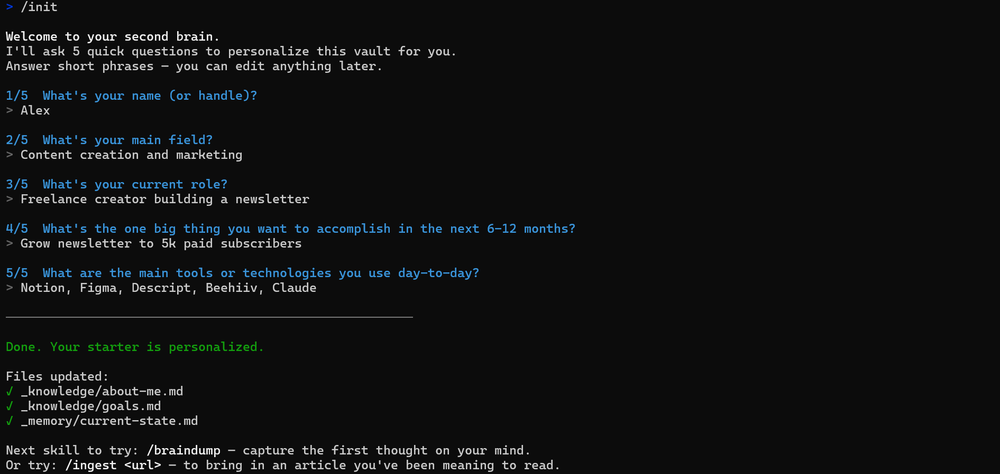
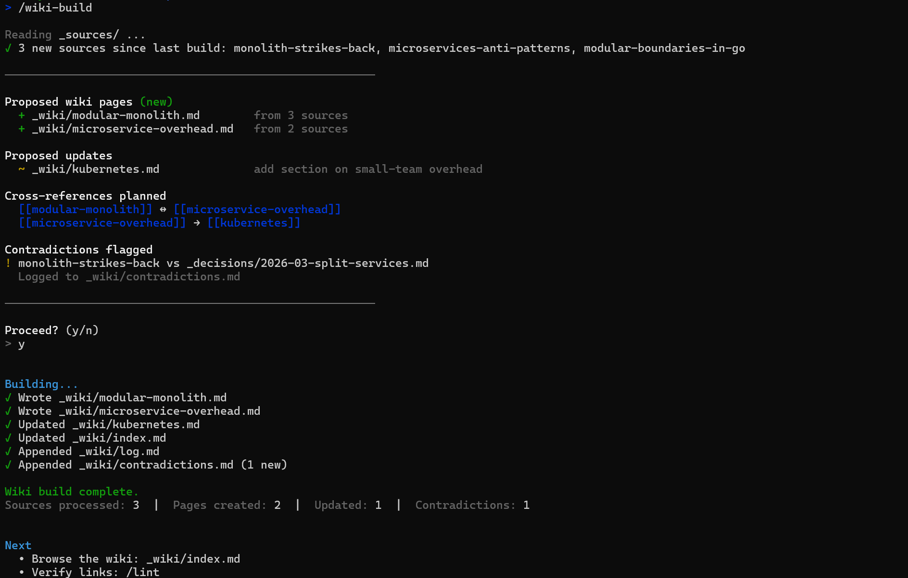
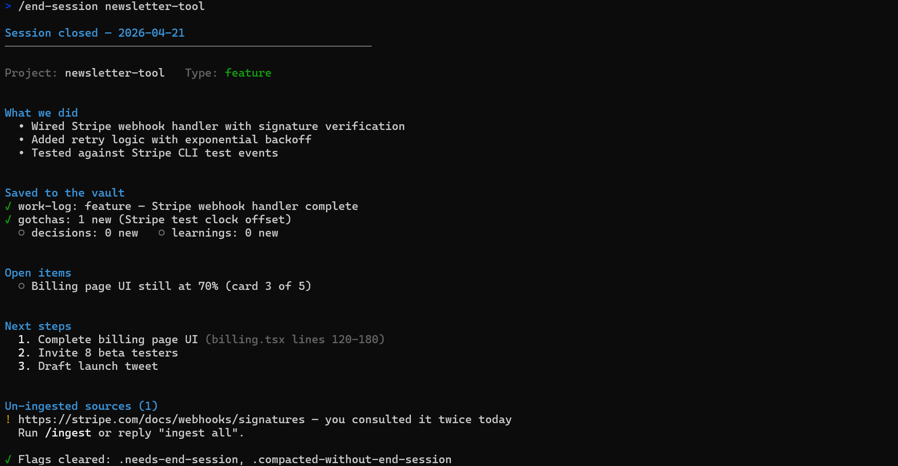

# Skills Reference

Every skill with an example command and a sample output, so you know what to expect.

Each skill is a plain markdown file in `_bootstrap/global/commands/`. You can read, edit, or improve them — changes take effect immediately.

---

## Setup

### `/init`

Interactive wizard. Personalizes `_knowledge/about-me.md` and `_knowledge/goals.md` in under 10 minutes.

**Use when:** first time, or when you want to reset your identity.

**Command:**
```
/init
```

**Sample output:**

<p align="center">
  
</p>

```
Welcome to your second brain.
I'll ask 5 quick questions to personalize this vault for you.

What's your name (or handle)?
> Alex

What's your main field?
> Content creation and marketing

... (3 more questions)

Done. Your starter is personalized.

Files updated:
- _knowledge/about-me.md
- _knowledge/goals.md
- _memory/current-state.md

Next skill to try: /braindump to capture the first thought on your mind.
```

---

## Capture

### `/braindump [text]`

Captures loose thoughts, categorizes them (idea, decision, urgent, pipeline), connects to prior notes via WikiLinks, challenges inconsistencies.

**Use when:** a thought is on your mind and you don't want to lose it.

**Command:**
```
/braindump I'm considering moving from freelance to founding an agency, but the cashflow risk scares me.
```

**Sample output:**
```
Summary: Tension between career evolution (agency) and financial stability (freelance cashflow).

Actionable items:
- High: quantify the risk — run 6-month cashflow projection for both paths.
- Medium: talk to 3 agency founders about their first 12 months.
- Low: research agency-as-a-service models (smaller risk footprint).

Notes created:
- _sessions/2026-04-21-braindump.md (tagged #idea, #decision, #career)

Connections: [[goals]], [[about-me]]

Challenge: Your goals.md states "build a sustainable income source". "Agency vs freelance" doesn't directly map — is the real question about income volatility or autonomy? Consider rewording the tension.
```

---

### `/ingest [source]`

Ingests **one source at a time**. Fetches, summarizes, shows takeaways, asks for approval, saves to `_sources/`. Offers to extract a learning.

**Use when:** you read an article, watched a video, or wrote a long thought and want to preserve it.

**Command:**
```
/ingest https://www.example.com/article-on-system-design
```

**Sample output:**
```
About to ingest: "The monolith strikes back" — example.com
Source: https://www.example.com/article-on-system-design

Summary (5 lines):
The author argues microservices added complexity without proportional
value for small teams. Presents 3 cases where going back to a monolith
improved velocity. Calls out specific Kubernetes overhead. Positions
"modular monolith" as the middle ground. Pragmatic tone.

Key claims:
- Teams under 20 engineers rarely need microservices.
- Modular monoliths give 80% of the organizational benefit at 20% of the cost.
- Kubernetes is an overhead tax on pre-product-market-fit startups.

Actionable takeaways:
- Audit our current architecture for "microservices by default" choices.
- Consider modular monolith for the next greenfield project.

Save to _sources/? (y/n, or suggest edits)
> y

Saved: _sources/2026-04-21-the-monolith-strikes-back.md

Do you want to extract the actionable insight into _learnings/? (y/n)
> y

Saved: _learnings/modular-monolith-as-default.md
```

---

## Compile

### `/wiki-build [--rebuild]`

Compiles `_sources/` into a cross-linked wiki in `_wiki/`. Shows the plan, asks approval, writes. Flags contradictions.

**Use when:** you have 3+ sources on related topics and want a knowledge base to query against.

**Command:**
```
/wiki-build
```

**Sample output:**

<p align="center">
  
</p>

```
Ready to build from: monolith-strikes-back, microservices-anti-patterns,
modular-boundaries-in-go

Proposed wiki pages (new):
- _wiki/modular-monolith.md        (from 3 sources)
- _wiki/microservice-overhead.md   (from 2 sources)

Proposed updates:
- _wiki/kubernetes.md              (add section on small-team overhead)

Cross-references planned:
- [[modular-monolith]] ↔ [[microservice-overhead]]
- [[microservice-overhead]] → [[kubernetes]]

Contradictions flagged:
- monolith-strikes-back vs _decisions/2026-03-split-services.md on
  "when to split". Logged to _wiki/contradictions.md.

Proceed? (y/n)
> y

Wiki build complete.
Sources processed: 3
Pages created: 2
Pages updated: 1
Contradictions flagged: 1

Next:
- Browse the wiki starting at _wiki/index.md
- Run /lint to verify links
```

---

## Daily rhythm

### `/daily-briefing`

Morning summary. Active projects, recent decisions, today's top priorities, vault health.

**Use when:** start of every work day.

**Command:**
```
/daily-briefing
```

**Sample output:**
```
Briefing — 2026-04-21

Current state:
Main focus this week is shipping v1 of the newsletter tool.
Secondary: wrapping up agency client project.

Active work:
| Project          | Phase     | Next step                     | Blocker |
|------------------|-----------|-------------------------------|---------|
| newsletter-tool  | MVP       | Wire Stripe subscription flow | none    |
| client-x-website | QA        | Run performance audit         | none    |

Recent decisions (last 7 days):
- 2026-04-19: Use Resend over Postmark for transactional email (cost).
- 2026-04-18: Defer i18n until 50 paying customers.

Today's priorities:
1. Wire Stripe — newsletter-tool — blocks paid beta
2. Performance audit — client-x — delivery Friday
3. Write weekly update — outreach — habit

Vault health: 9/10. No pending items.

Direct alert: newsletter-tool has had no commits for 3 days. Intentional pause or drift?
```

---

### `/weekly-review`

Weekly reflection. Progress per project, patterns, course corrections, next week's top 3.

**Use when:** every Monday, or end of week.

**Command:**
```
/weekly-review
```

**Sample output:**
```
Weekly Review — 2026-04-21

Week summary:
Solid on newsletter-tool MVP. Lost 2 days to client-x scope creep.

Portfolio progress:
| Project         | Phase | What moved                        | On schedule? |
|-----------------|-------|-----------------------------------|--------------|
| newsletter-tool | MVP   | Auth + signup flow done           | yes          |
| client-x-site   | QA    | 70% of audit, stuck on LCP        | late         |

Decisions this week:
- Resend over Postmark.
- Defer i18n until 50 paying customers.

Learnings this week:
- Modular monolith as default for new greenfield work.

What worked:
- Batching deep work on Tuesday / Thursday.
- Running /daily-briefing every morning (no context loss).

What didn't work:
- Client-x scope creep went unaddressed for 4 days.

Suggested adjustments:
- Next week, spend 1h Monday scoping client-x remainder.

Next week's priorities:
1. Ship newsletter-tool MVP to beta list (8 testers).
2. Close client-x audit and deliver report.
3. One /content-idea session for newsletter launch.

Direct alert: Content pipeline is empty. No drafts for the newsletter launch 14 days out.
```

---

### `/focus [project]`

Surgical context load for one project. Minimum reads, maximum signal.

**Use when:** you're about to work on a specific project and want Claude oriented fast.

**Command:**
```
/focus newsletter-tool
```

**Sample output:**
```
Focus: newsletter-tool

Phase: MVP
Last session: 2026-04-19

Context:
Auth and signup flow shipped. Stripe subscription wiring is next — the
gate to paid beta. No blockers, but Stripe webhook retry logic needs careful test.

Next step:
Implement Stripe webhook handler at /api/stripe/webhook with signed-payload verification.

Active gotchas:
- Resend webhook domain must be verified before it will deliver transactional emails.
- Stripe's test clock needs a 1-hour offset to reproduce renewal events reliably.

Open items:
- Finish billing page UI (from Friday's session).

Context loaded. Ready to start.
```

---

## Close / Resume

### `/end-session [project]`

Closes the session. Classifies work, updates work-log, saves gotchas, decisions, current-state, clears flags.

**Use when:** end of every work session.

**Command:**
```
/end-session newsletter-tool
```

**Sample output:**

<p align="center">
  
</p>

```
Session closed — 2026-04-21

Project: newsletter-tool | Type: feature

What we did:
- Wired Stripe webhook handler with signature verification.
- Added retry logic with exponential backoff.
- Tested against Stripe CLI test events.

Saved to the vault:
- work-log: feature — Stripe webhook handler complete
- gotchas: 1 new (Stripe test clock offset)
- decisions: 0 new
- learnings: 0 new

Open items:
- Billing page UI still at 70%.

Next steps:
- Complete billing page UI (billing.tsx).
- Invite 8 beta testers.
- Write launch tweet draft.

Un-ingested sources (1):
- https://stripe.com/docs/webhooks/signatures — relevant; you consulted it twice today.
> Run /ingest or reply "ingest all".
```

---

### `/session-handoff`

Writes a `HANDOFF.md` (and optional `SESSION-CHECKPOINT.md`) so the next session resumes without re-discovery.

**Use when:** you're stopping mid-task and tomorrow needs the exact same context.

**Command:**
```
/session-handoff
```

**Sample output:**
```
HANDOFF.md created at /home/you/second-brain.

Goal: Complete billing page UI for newsletter-tool MVP.

Done:
- Stripe webhook handler with signature verification.
- Retry logic with exponential backoff.

In progress (resume here):
- billing.tsx: card 3 of 5 complete. Next action: implement CancelSubscription component (lines 120-180).

What did NOT work:
- Tried server-side portal redirect — blocked by Stripe customer portal not being configured in test mode. Configure it first or use client-side session redirect.

Next steps:
1. billing.tsx line 120 — implement CancelSubscription
2. billing.tsx line 180 — wire to Stripe billing_portal.sessions.create
3. Run: npm test (expect auth tests to pass, billing tests to partially fail)

Gitignored: HANDOFF.md added to .gitignore.
```

---

## Output

### `/content-idea [topic]`

Generates 3-7 content ideas grounded in YOUR real vault material (learnings, decisions, projects, sources).

**Use when:** you need to post, write, or produce content and want ideas with roots.

**Command:**
```
/content-idea LinkedIn post about lessons from building newsletter-tool
```

**Sample output:**
```
Content ideas — 2026-04-21

Context used:
Read: _learnings/modular-monolith-as-default.md,
       _knowledge/projects/newsletter-tool/work-log.md (last 5 entries),
       _decisions/2026-04-19-resend-over-postmark.md

Idea 1: "The $300 email decision that saved me 20 hours"
| Format   | LinkedIn post |
| Platform | LinkedIn      |
| Angle    | The cost/time math of picking Resend over Postmark — concrete numbers from building newsletter-tool |
| Why it works | Developers love specific dollar/hour math |

Outline:
1. Hook: "I almost paid 3x more for transactional email."
2. Context: Building newsletter-tool, needed transactional delivery.
3. What I learned: Pricing models are different — Resend's free tier covered my use case for 4 months longer.
4. Insight: Email API pricing isn't compared often because it's boring. It shouldn't be.
5. CTA: What's the boring choice you're overpaying for?

Vault source: [[2026-04-19-resend-over-postmark]]

---

Idea 2: "The Stripe webhook mistake that cost me a weekend"
... (shortened)

Which one do you want to develop? I can expand the full outline or draft the piece.
```

---

## Maintenance

### `/lint`

Audits vault health: frontmatter, stale notes, broken links, orphan files, wiki integrity. Reports a score.

**Use when:** vault feels messy; after large refactors; every few weeks.

**Command:**
```
/lint
```

**Sample output:**
```
Lint report — 2026-04-21

Overall score: 8/10

| Check                  | Defects | Warnings | Status |
|------------------------|---------|----------|--------|
| Required frontmatter   | 2       | —        | FAIL   |
| Stale active notes     | —       | 3        | ATTENTION |
| Broken WikiLinks       | 1       | —        | FAIL   |
| Orphan files           | —       | 4        | ATTENTION |
| Wiki integrity         | 0       | 0        | OK     |

Critical defects:
1. _learnings/early-pricing-signals.md — missing `status` field
2. _decisions/2026-03-split-services.md — missing `created` field
3. _wiki/modular-monolith.md — broken link [[non-existent-page]]

Prioritized actions:
1. Add missing frontmatter fields to 2 files (5 minutes).
2. Fix broken WikiLink in _wiki/modular-monolith.md.
3. Review 3 stale active notes — either update or mark completed.
```

---

### `/skill-improve [path]`

Runs a Karpathy-style autoresearch loop on a target skill: mutate, test, score, keep the wins.

**Use when:** a skill feels below its potential; you suspect it's missing edge cases.

**Command:**
```
/skill-improve _bootstrap/global/commands/content-idea.md
```

**Sample output (abbreviated across 3 phases):**
```
# Phase 1 — Setup
Read skill: content-idea.md
Generated 8 test cases (empty arg, specific topic, multiple platforms, sensitive data check, etc.)
Rubric (1-5): concreteness, truthfulness, angle-uniqueness, vault-anchoring, format-fit

Baseline scores:
- concreteness: 3.2 / 5
- truthfulness: 4.8 / 5
- angle-uniqueness: 2.9 / 5     ← weak
- vault-anchoring: 3.4 / 5
- format-fit: 4.1 / 5

Converted weak dimension to binary:
- angle-uniqueness → "Does each idea reference a specific fact/decision from the vault, not a generic claim?"

Loop bounds: max 10 iterations, stop if no improvement for 3 consecutive, dry-run on.

Continue to Phase 2? (y/n)
> y

# Phase 2 — Loop (autonomous, bounded)
Iteration 1: added "source citation" requirement to each idea → kept (binary pass 60% → 75%)
Iteration 2: tightened hook format → kept (binary pass 75% → 82%)
Iteration 3: added negative example ("don't write 'In this post I'll talk about...'") → kept (binary pass 82% → 88%)
Iteration 4: no improvement, dropped
...
Stopped after 6 iterations.

# Phase 3 — Debrief
Re-scored against original rubric:
- concreteness: 3.2 → 4.1 (+0.9)
- angle-uniqueness: 2.9 → 4.3 (+1.4)  ← biggest win
- binary pass rate: 60% → 92%

Diff preview shown. Apply to live skill? (y/n)
> y

Report saved: _learnings/skill-improve-content-idea-2026-04-21.md
```

---

## Full source

Every skill is a plain markdown prompt. Read the source to understand exactly what it does:

```bash
cat _bootstrap/global/commands/<skill-name>.md
```

You can edit any of them and the change takes effect on your next invocation.
