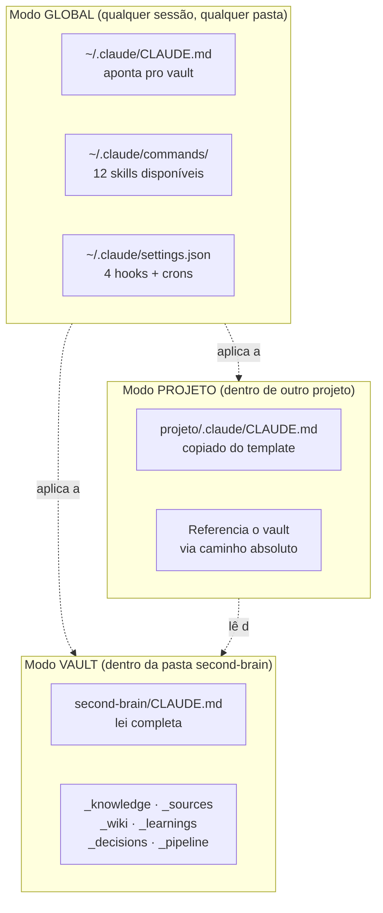

# Começando

Tour de 10 minutos do zero ao segundo cérebro — escrito para quem nunca usou Claude Code.

<p align="center">
  
</p>

<details>
<summary>📐 Três modos de operação (texto)</summary>



</details>

## Antes de começar: glossário

Termos rápidos para nada travar.

| Termo | Significado em português claro |
|-------|-------------------------------|
| **Claude Code** | CLI da Anthropic. Você digita `claude` no terminal e começa a conversar com o Claude. Ele lê e edita arquivos do seu disco. |
| **Vault** | A pasta onde seu segundo cérebro vive. Você clona este repo numa pasta, e aquela pasta *é* seu vault. |
| **Skill** | Uma instrução pré-escrita que vira um slash-command no Claude Code. `/braindump`, `/ingest`, etc. Cada uma é um arquivo markdown em `_bootstrap/global/commands/`. |
| **Hook** | Script pequeno que roda automaticamente em evento (você envia prompt, Claude encerra sessão, etc.). Quatro vêm pré-configurados. |
| **Cron job** | Task agendada no sistema operacional. O starter adiciona duas: heartbeat diário (07:00) e lint semanal (segunda 09:00). |
| **Markdown** | Formato de texto leve. Asterisco pra negrito, hífen pra lista. Todo arquivo do vault é markdown. |
| **Frontmatter** | Bloco no topo do arquivo com metadados: `tags`, `status`, `created`. YAML entre linhas `---`. |
| **WikiLink** | Referência a outra nota, escrita como `[[nome-da-nota]]`. Funciona tipo link da Wikipedia. |
| **Slash-command** | Comando no Claude Code que começa com `/`, tipo `/init`. |

---

## Pré-requisitos

### 1. Instalar Claude Code

```bash
npm install -g @anthropic-ai/claude-code
```

Se não tem Node.js, instale antes em [nodejs.org](https://nodejs.org) (versão LTS).

Verificar:
```bash
claude --version
```

Conta Anthropic necessária — API credits ou Claude Pro/Max. Ver [claude.com/pricing](https://claude.com/pricing).

### 2. Instalar `jq`

| SO | Comando |
|----|---------|
| Ubuntu / Debian / WSL | `sudo apt install jq` |
| Fedora / RHEL | `sudo dnf install jq` |
| macOS | `brew install jq` |

### 3. Conferir `crontab`

```bash
crontab -l
```

"no crontab for..." é OK — o install vai adicionar entradas.

No WSL, suba o cron daemon:
```bash
sudo service cron start
```

### Windows nativo

Não funciona. Instale [WSL2](https://learn.microsoft.com/pt-br/windows/wsl/install) antes (10 min, grátis).

---

## Instalação

```bash
# 1. Clone numa pasta do seu home (sem sudo)
git clone https://github.com/<SEU-USUARIO>/second-brain-starter.git ~/second-brain

# 2. Entre
cd ~/second-brain

# 3. Rode o install
./install.sh
```

Idempotente: pode rodar várias vezes. Nunca toca seus dados pessoais.

**O que o install faz:**

1. Cria 12 atalhos em `~/.claude/commands/` (um por skill).
2. Adiciona 4 hooks em `~/.claude/settings.json`.
3. Anexa "Second Brain" em `~/.claude/CLAUDE.md` para o Claude ler seu vault.
4. Adiciona 2 crons (heartbeat + lint).
5. Cria `_memory/current-state.md` e `_memory/activity-log.md`.

Se algo der errado: [troubleshooting.md](troubleshooting.md).

---

## Primeira sessão

Abra terminal, digite `claude`. Está dentro do Claude Code. Tudo abaixo é digitado naquele chat.

### Passo 1 — Wizard

```
/init
```

Cinco perguntas rápidas. Preenche `_knowledge/about-me.md`, `_knowledge/goals.md`, seeda `_memory/current-state.md`. 3 minutos.

### Passo 2 — Capturar um pensamento

```
/braindump Fiquei 3 meses empatado entre 3 ideias de projeto. Preciso escolher uma.
```

Claude:
1. Cria nota em `_sessions/2026-04-21-braindump.md`.
2. Categoriza cada item (ideia / decisão / urgente).
3. Conecta com `_knowledge/goals.md` via WikiLinks.
4. Responde com resumo + itens acionáveis + provocação (se algo for inconsistente, ele aponta).

30 segundos.

### Passo 3 — Ingerir uma fonte

```
/ingest https://exemplo.com/artigo-que-voce-acabou-de-ler
```

Claude busca, resume, mostra key claims e takeaways, pergunta: "Salvar em `_sources/`? (s/n)".

Aprovando → arquivo salvo. Oferece extrair um learning. 1-2 min por fonte.

### Passo 4 — Construir wiki

Com 3+ fontes:

```
/wiki-build
```

Claude:
1. Lê todas fontes.
2. Extrai entidades/conceitos/claims.
3. Propõe páginas wiki com cross-refs.
4. Mostra o plano, pede aprovação.
5. Escreve em `_wiki/`, atualiza `index.md`, loga em `log.md`, registra contradições.

### Passo 5 — Encerrar sessão

```
/end-session
```

Atualiza `current-state.md`, `activity-log.md`, work-log do projeto (se tocou algum), cria learnings/decisions se couber. Limpa flags pendentes. 1 minuto.

### Passo 6 — No dia seguinte

```bash
claude
```

Depois:
```
/daily-briefing
```

Você recebe: resumo do estado atual, projetos ativos, decisões recentes, top 3-5 de prioridades, saúde do vault.

**Você nunca "perde" contexto entre sessões.**

---

## Ritmo semanal

| Quando | O quê |
|--------|-------|
| Início do dia | `/daily-briefing` |
| Pensamento surgiu | `/braindump "..."` |
| Li algo valioso | `/ingest <url-ou-arquivo>` |
| Depois de uns ingests | `/wiki-build` |
| Começar trabalho em projeto | `/focus <nome-do-projeto>` |
| Fim do dia | `/end-session` |
| Parando no meio de uma task | `/session-handoff` |
| Toda segunda | `/weekly-review` |
| Precisando de ideias | `/content-idea <tema>` |
| Vault bagunçado | `/lint` |
| Skill parece fraca | `/skill-improve <caminho-da-skill.md>` |

Não vai precisar de todas todo dia. `/braindump` + `/ingest` + `/daily-briefing` + `/end-session` resolve 90% dos casos.

---

## Próximos passos

- [Referência de skills](skills-reference.md) — toda skill com exemplo de output.
- [Hooks e crons](hooks-and-crons.md) — o que roda em background.
- [FAQ](faq.md)
- [Troubleshooting](troubleshooting.md)
- [Filosofia](philosophy.md)
