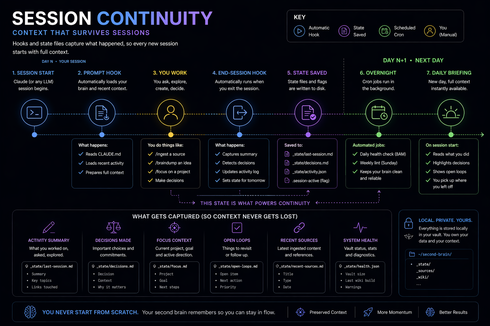
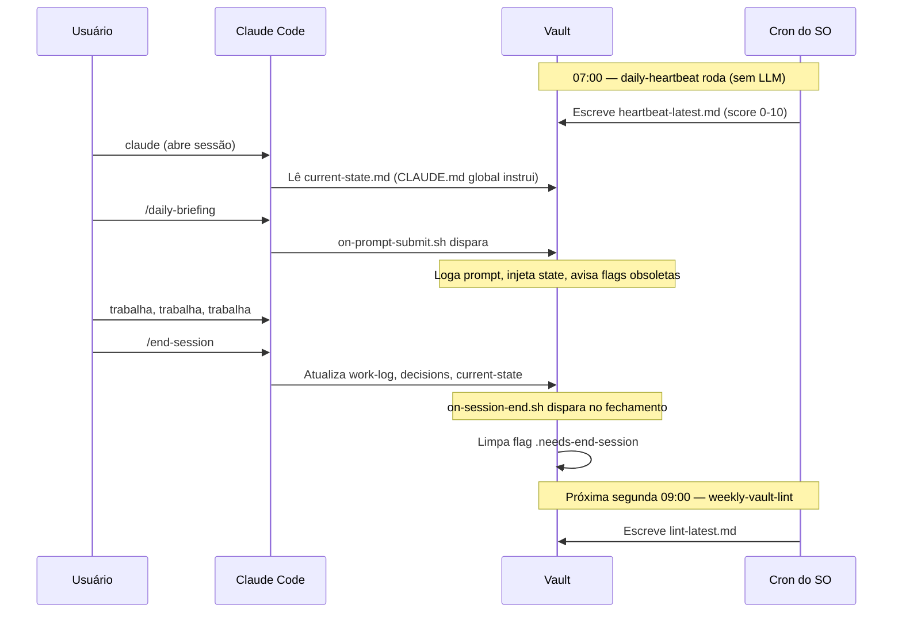

# Hooks e Cron Jobs

O starter ativa 4 hooks e 2 cron jobs para manter o vault vivo entre invocações explícitas de skills. Qualquer peça pode ser desligada sem quebrar o resto.

<p align="center">
  
</p>

<details>
<summary>📐 Timeline de continuidade (texto)</summary>



</details>

## Hooks (orientados a evento, disparam dentro do Claude Code)

Definidos em `_bootstrap/global/settings.json`, mesclados em `~/.claude/settings.json` pelo `install.sh`. Scripts em `_bootstrap/global/hooks/`.

### `UserPromptSubmit` → `on-prompt-submit.sh`

Dispara em todo prompt. Faz:
- Loga o prompt em `_memory/.prompt-log.txt` (gitignored, local).
- Se o projeto tem `_knowledge/projects/{projeto}/state.md`, injeta uma vez por dia por projeto.
- Alerta uma vez por dia por projeto se:
  - Sessão anterior encerrou sem `/end-session`.
  - Houve compactação sem `/end-session` prévio.
  - `_memory/current-state.md` está mais de 3 dias sem atualização.

Se não tem alerta, sai silencioso. Timeout: 5 segundos.

### `SessionEnd` → `on-session-end.sh`

Dispara quando a sessão do Claude Code termina. Faz:
- Append de `session-end` em `_memory/activity-log.md`.
- Atualiza campo `updated:` em `_memory/current-state.md`.
- Cria flag `_memory/.needs-end-session` se `/end-session` não rodou.

### `PreCompact` → `on-pre-compact.sh`

Dispara antes de compactação de contexto. Faz:
- Extrai Next Steps e Open Questions do `current-state` para `_memory/.pre-compact-notes.md`.
- Copia para o activity-log.
- Remove o arquivo `.pre-compact-notes.md`.
- Cria flag `_memory/.compacted-without-end-session` se `/end-session` não rodou antes.

### `Notification` → `on-notification.sh`

Dispara ao concluir operação longa. Toast Windows (WSL) ou bell do terminal (Linux/macOS).

---

## Cron jobs (orientados a tempo, rodam fora do Claude Code)

Registrados no crontab do SO pelo `install.sh`. Scripts em `_bootstrap/scripts/`. Logs em `.logs/`.

### `daily-heartbeat.sh` — todo dia 07:00

Sem LLM. Calcula:
- Staleness de `_memory/current-state.md`.
- Projetos ativos em `_knowledge/projects/`.
- Fontes em `_sources/`.
- Páginas compiladas em `_wiki/`.
- Flags pendentes de sessão.

Escreve `_memory/heartbeat-latest.md` com score 0-10.

### `weekly-vault-lint.sh` — segunda 09:00

Sem LLM. Verifica:
- Frontmatter obrigatório (`tags`, `status`, `created`) em `_learnings/`, `_decisions/`, `_pipeline/`, `_knowledge/projects/`.
- Notas `status: active` com `updated` > 30 dias.
- `[[WikiLinks]]` quebrados no `_wiki/`.

Escreve `_memory/lint-latest.md`. Alerta crítico no heartbeat se > 5 defeitos.

### `graph_metrics.py` — sob demanda ou agendado

Sem LLM. Python stdlib puro. Produz `_memory/graph-metrics.md` com:

- Total de `.md` e total de WikiLinks (só prosa, ignora frontmatter/code).
- Ilhas por categoria (arquivos sem links de saída).
- Top 15 hubs por in-degree.
- Lista de WikiLinks quebrados (alvo: 0).
- Violações de frontmatter contra a taxonomia embutida.

Rodar:

```bash
python3 _bootstrap/scripts/graph_metrics.py
```

Ou agendar semanal:

```
0 8 * * 1 python3 {VAULT}/_bootstrap/scripts/graph_metrics.py >> {VAULT}/.logs/graph-metrics.log 2>&1
```

O arquivo de saída é gitignored — é artefato derivado, o vault markdown é a source of truth.

### `weekly-prompt-consolidation.sh` — domingo 23:00

Sem LLM no momento do cron. Verifica os prompts acumulados em `_memory/.prompt-log.txt` (escrito pelo `on-prompt-submit.sh`). Quando o total cruza um threshold (default: 30):

- Gera estatísticas estruturais: total de prompts, contagem de slash commands, cwds distintos, top 5 slash commands.
- Escreve `_memory/.prompt-log-stats.txt`.
- Cria flag `_memory/.consolidation-ready` — o `on-prompt-submit.sh` exibe um aviso no próximo prompt sugerindo rodar uma análise via LLM (skill à sua escolha).

A análise real de padrões só acontece quando você invoca a skill — o cron apenas decide *quando* há sinal suficiente para valer a pena. Construa sua própria skill de análise sobre `_memory/.prompt-log.txt` + `_memory/.prompt-log-stats.txt`.

Para registrar o cron:

```
0 23 * * 0 bash {VAULT}/_bootstrap/scripts/weekly-prompt-consolidation.sh >> {VAULT}/.logs/weekly-prompt-consolidation.log 2>&1
```

---

## Flags de sessão

Criadas e limpas automaticamente. Você pode apagar manualmente se souber que o vault está sincronizado.

| Flag | Criada quando | Limpa por |
|------|--------------|-----------|
| `_memory/.needs-end-session` | Sessão encerrou sem `/end-session` | Próximo `/end-session` |
| `_memory/.compacted-without-end-session` | Houve compactação sem `/end-session` antes | Próximo `/end-session` |

---

## Desligar partes

### Desligar um hook

Edite `~/.claude/settings.json` e remova a entrada. Re-rodar `install.sh` adiciona de novo, então se quer desligar para sempre, remova também de `_bootstrap/global/settings.json`.

### Desligar um cron

```bash
crontab -e
# apague a linha do daily-heartbeat ou weekly-vault-lint
```

### Desinstalar tudo

```bash
# remove symlinks de skills
rm ~/.claude/commands/{braindump,ingest,focus,daily-briefing,weekly-review,end-session,session-handoff,content-idea,lint,init,wiki-build,skill-improve}.md

# remove bloco "## Second Brain" de ~/.claude/CLAUDE.md manualmente
# reverta ~/.claude/settings.json pelo .bak (se install.sh gerou)

# remove crons
crontab -e
```

---

## Troubleshooting

### Hooks não disparam

- `~/.claude/settings.json` tem as entradas?
- Scripts executáveis? `chmod +x _bootstrap/global/hooks/*.sh`.
- `{VAULT}` foi resolvido? (não deve sobrar literal na settings.json).

### Cron não roda

- `crontab -l` confirma entradas.
- WSL: `sudo service cron status`, inicie se parado.
- `.logs/` tem saída da última execução.

### Prompt log está enchendo

- `_memory/.prompt-log.txt` é gitignored mas local. Rotacione quando crescer:
  ```bash
  mv _memory/.prompt-log.txt _memory/.prompt-log-$(date +%Y%m%d).txt
  ```
